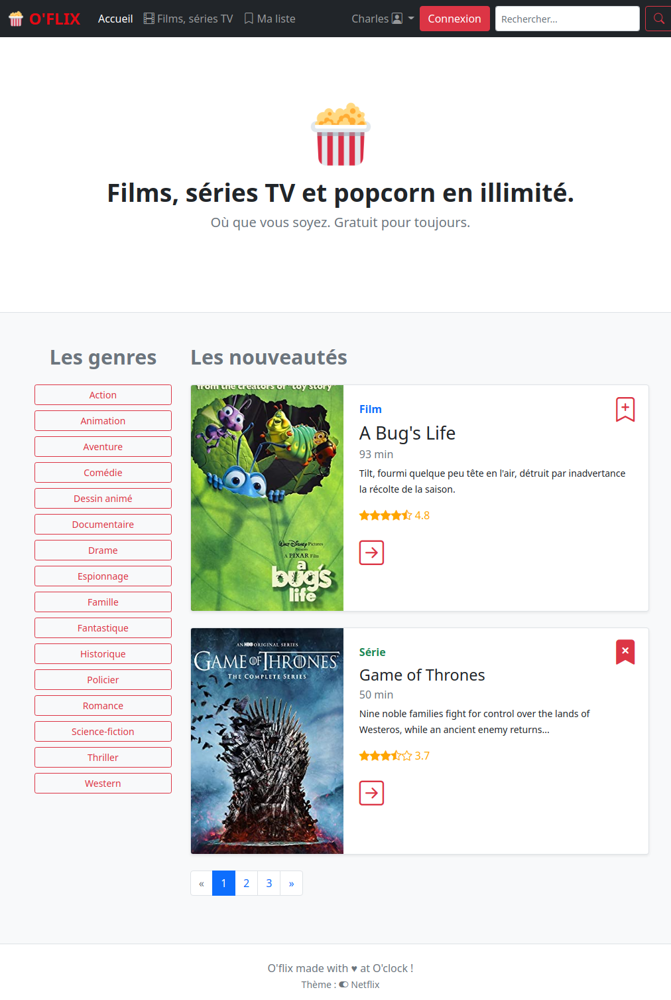
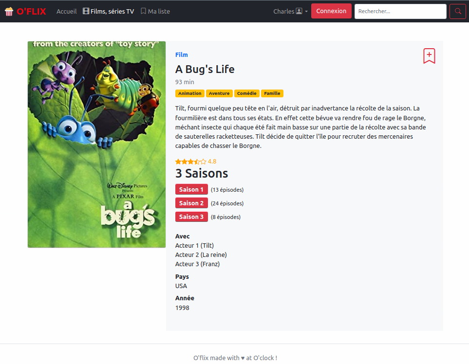
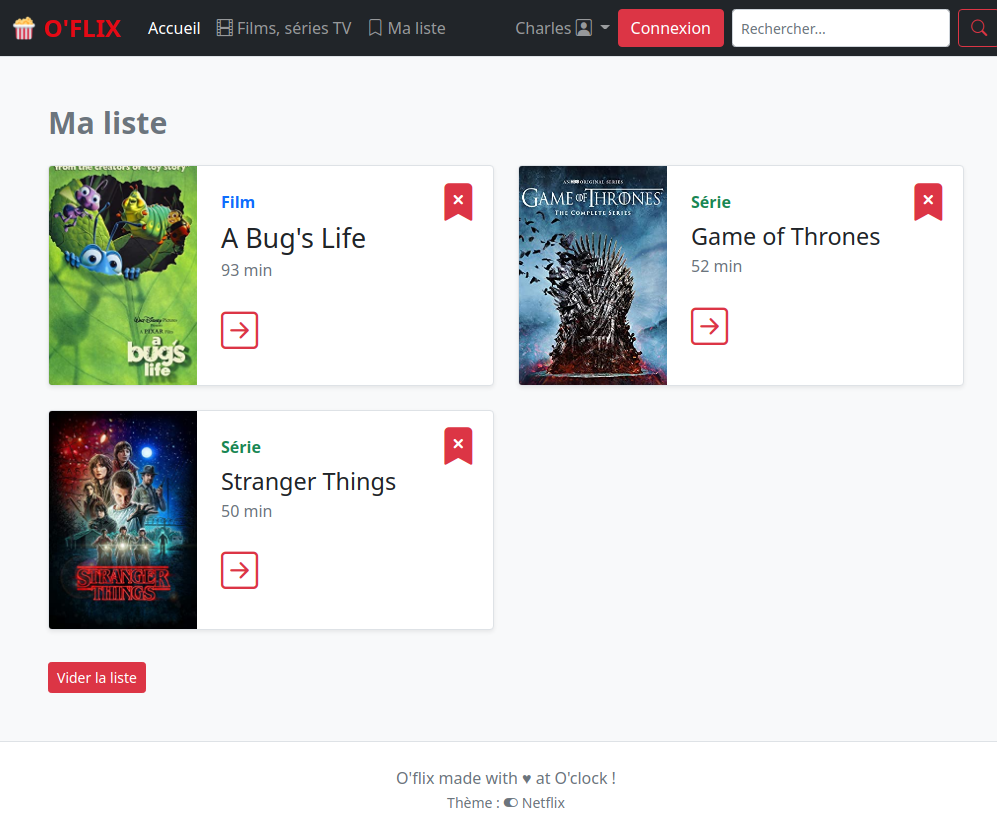

# Projet O'flix Symfony 

Voici mon premier projet Symfony : Oflix qui repertorie les films et les séries.

##  HMTL/CSS fournie
### 1. Page d'accueil

### 2. Page du film ou de la série

### 3. Page des favoris utilisateur

### 4. Liste des films ou des Résultats de recherche

---

### Installation

Installer un nouveau projet Symfony _"skeleton"_, via _composer_, depuis votre dossier cloné :

- `composer create-project symfony/skeleton oflix`

- Remonter le dossier créé 
`mv sous-dossier/* sous-dossier/.* .`
Puis supprimer le dossier
`rmdir sous-dossier`

> :hand: On peut utiliser le serveur PHP pour lancer l'appli Symfony : `php -S 0.0.0.0:8000 -t public`.
> 
> :hand: Ou passer par Apache, on installe le `.htaccess` via `composer require symfony/apache-pack` 
# Installation Twg:
composer require twig/twig

# Installation des assets
composer require symfony/asset

# Création des sessions :
composer require symfony/http-foundation

# Installation d'un profiler
composer require --dev symfony/profiler-pack

# Installation de Doctrine ( pas besoin de Docker)
composer require symfony/orm-pack
composer require --dev symfony/maker-bundle

### Les routes

>Modification du fichier .env

### Les assets

Dans le dossier `public` copier les 2 sous-dossiers `css` et `images` du dossier `sources/html-css`.

---

### Intégration des templates HTML/CSS brutes

Nous allons, créer les contrôleurs, méthodes et templates nécessaires pour afficher les pages HTML/CSS dans notre appli Symfony. Nous les dynamiserons ensuite.

- Vous pourrez afficher les routes dans le terminal avec `debug:router`.
- Créer les contrôleurs, méthodes et templates associés afin de créer les pages d'accueil et du film.
- Pour ajouter Twig à Symfony, l'inclure au projet via `composer require twig` :paintbrush:

### Dynamisation : Page d'accueil

1. Récupérer la liste des films et la dumper via `dump()` depuis la page d'accueil.
   - Pour ce faire, trouver le moyen d'accéder aux données de **`data.php` (notre Model "statique")** (on cherchera une solution en PHP objet de préféfence :wink:). Pas de bases de données pour le moment, on verra ça dans quelques jours.
2. Dynamiser la vue associée (rubrique _Templates / Linking to Pages_). Une petite boucle `for` ?

> Vous souhaitez des infos sur l'exécution de votre code ? => `composer require profiler` :tada:

### Dynamisation : Liens

Dans la boucle du template de liste :

1. Afficher le poster de chaque film (rubrique _Templates > Linking to CSS, JavaScript and Image Assets_).
2. Générer des liens avec l'id du film concerné (rubrique _Templates > Linking to Pages_). Trouver le moyen d'identifier un film depuis le tableau.

### Dynamisation : Page du film

1. Récupérer l'index du film à afficher depuis l'URL et le dumper pour vérification (rubrique _Routing / Generating URLs_).
2. Récupérer les données du film, les transmettre à la vue et dynamiser le template (rubrique _Templates / Twig_).
   - Créer la vue associée avec l'héritage du layout principal (dont l'en-tête sera noire et pas jaune pour le moment).
3. Que faire si l'index n'existe pas dans les data ? (pensez _"HTTP"_ cf rubrique _Controllers_)

### Routes (suite)

Que faire si le paramètre `id` de la route `show` n'est pas au format numérique ? Ou encore, essayez de passer une chaine de caractères dans l'URL pour voir ce qui se passe.

- Trouver le moyen de mettre des contraintes sur les paramètres de routes, ici sur l'id du film qui doit être un entier (rubrique _Routing > Parameters Validation_).

### API

Cela n'est pas précisé dans les captures mais vous pourriez proposer un accès API/JSON qui renvoie les données des films/séries vers une appli front.

- Récupérer l'ensemble des data et les encoder en JSON (rubrique _Controllers > Returning JSON Response_).

### Favoris

Sans base de données, proposer un sélection de favoris que l'on stockera en session coté serveur.

[Lire le README pour la gestion des favoris](README-Favorites.md)

## Lectures

- Parcourir [les conventions de codage et de nommage de Symfony](https://symfony.com/doc/current/contributing/code/standards.html).  
Elles vous permettront d'avoir **une base pour l'écriture de votre code**.
- [Les fondamentaux HTTP, vus par Symfony](https://symfony.com/doc/current/introduction/http_fundamentals.html).

## Bonus

### *Theme switcher*

En bonus, on pourra créer un _theme switcher_ (sélecteur de thème) pour choisir le thème Netflix ou Allociné (voir le bouton dans le pied de page).
On le notera par un **changement de couleur de la nav** : Netflix en noir / Allociné en jaune.

> Ce bonus sert principalement à s'exercer avec les concepts de Symfony, la gestion d'un thème se faisant plutôt côté client (cookie, LocalStorage) ou le cas échéant dans le profil de l'utilisateur côté back, à voir quand on découvrira l'usage des bases de données.

[Plus d'info par ici](README-Theme-switcher.md)

## Installation de DoctrineFixturesBundle
`composer req --dev make doctrine/doctrine-fixtures-bundle`

## Installation de Faker
`composer require --dev fzaninotto/faker`